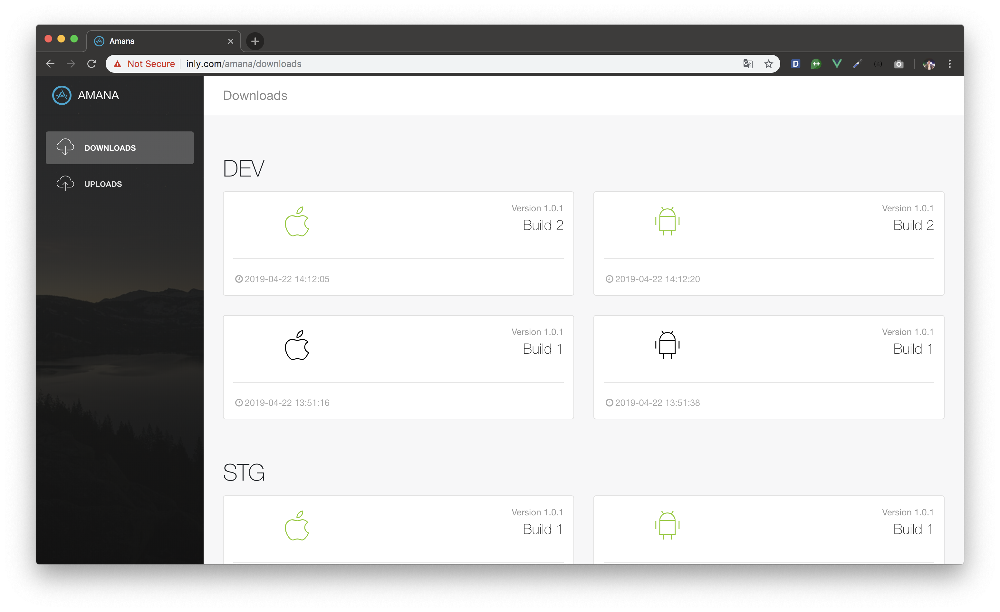
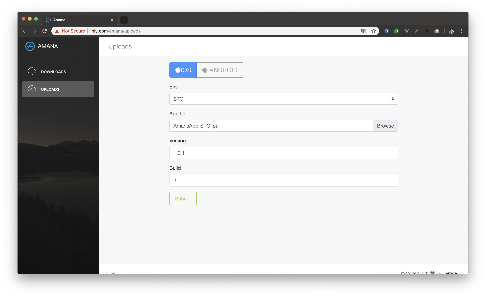

# App Version Managements (IOS, Android) Laravel 5.8




## Install 
Require this package with composer using the following command: <br>
`composer require herode/amana`

After updating composer, You can also publish the config file, migrations file, public ... via command

`php artisan amana:install`

Next, run migrations

`php artisan migrate`

Add config disk storage, open file: `config/filesystems.php`, add this line bellow

```$xslt
  'disks' => [
        ...
        'amana' => [
            'driver' => 'local',
            'root'   => public_path('amanas')
        ],
  ]
```

Clear config

`php artisan config:cache`

`composer dump-autoload`

Done, we can access `domain.com/amana`

## Configure

Open file `app\amana.php`

### Config domain - default not use (null)
```
/*
    |--------------------------------------------------------------------------
    | Amana Domain
    |--------------------------------------------------------------------------
    |
    | This is the subdomain where Amana will be accessible from. If this
    | setting is null, Amana will reside under the same domain as the
    | application. Otherwise, this value will serve as the subdomain.
    |
    */

    'domain' => null,

```

### Config path - You can use the path default = `domain.com/amana`

```
/*
    |--------------------------------------------------------------------------
    | Amana Path
    |--------------------------------------------------------------------------
    |
    | This is the URI path where Amana will be accessible from. Feel free
    | to change this path to anything you like. Note that the URI will not
    | affect the paths of its internal API that aren't exposed to users.
    |
    */

    'path' => 'amana',

```

### Config middleware - Default `web`

```
/*
    |--------------------------------------------------------------------------
    | Amana Route Middleware
    |--------------------------------------------------------------------------
    |
    | These middleware will get attached onto each Amana route, giving you
    | the chance to add your own middleware to this list or change any of
    | the existing middleware. Or, you can simply stick with this list.
    |
    */

    'middleware' => ['web'],
    
```

### Config App Bundle ID for earch envirimoment

```
/*
    |--------------------------------------------------------------------------
    | Amana Bundle ID
    |--------------------------------------------------------------------------
    |
    | Bundle id each environment for app
    |
    */
    'bundle_id' => [
        'dev'  => 'bundle_id.dev',
        'stg'  => 'bundle_id.stg',
        'prod' => 'bundle_id.prod',
    ]

```

## Gitignore

Add `public/amanas` into `.gitignore` file in root project


## License
